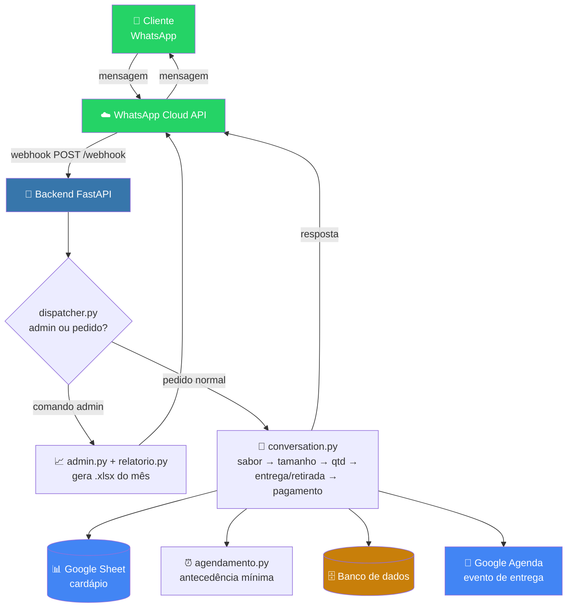

<div align="center">

# 🍿 PipocaBot

**Atendimento automático de pedidos via WhatsApp para a Diadê Pipocas Gourmet**


</div>

---

## Índice

- [Sobre o projeto](#-sobre-o-projeto)
- [Como funciona](#-como-funciona)
- [Recursos já implementados](#-recursos-já-implementados)
- [Rodando localmente](#-rodando-localmente)
- [Documentação](#-documentação)
- [Stack](#️-stack)
- [Estrutura do projeto](#️-estrutura-do-projeto)
- [Status atual](#-status-atual)

## 📋 Sobre o projeto

O cliente faz o pedido inteiro conversando com o bot no WhatsApp — escolhe
sabor, tamanho, quantidade, entrega ou retirada, e forma de pagamento — sem
que ninguém da loja precise responder mensagem manualmente.

A loja só interage com três lugares:

| Onde | Para quê |
|---|---|
| 📅 **Google Agenda** | Ver as entregas previstas do dia/semana |
| 📊 **Google Sheet do cardápio** | Editar sabores, tamanhos, preços e disponibilidade, sem mexer em código |
| 📈 **Relatório mensal** | Pedir pelo WhatsApp (número admin) e receber a quantidade vendida por sabor/tamanho |

> [!NOTE]
> Projeto em construção ativa. A documentação em [`docs/`](docs/) é escrita
> junto com o desenvolvimento — cada decisão, cada bug real encontrado em
> teste e cada etapa concluída fica registrada lá, com data e contexto.

## 🔄 Como funciona



1. Cliente manda mensagem no WhatsApp da loja.
2. A Meta (WhatsApp Cloud API) entrega essa mensagem ao backend via *webhook*.
3. O backend decide se é um comando administrativo (só o número da loja) ou um pedido normal.
4. Na conversa, consulta o cardápio atualizado numa Google Sheet (com cache) e valida a antecedência mínima do pedido.
5. Ao confirmar, salva o pedido no banco e cria automaticamente um evento no Google Agenda.
6. Sob comando (`relatorio`), gera uma planilha `.xlsx` com o total vendido por sabor/tamanho do mês.

## ✨ Recursos já implementados

- **Fluxo de pedido completo**, com múltiplos sabores numa mensagem só (`"Nutella e Torta de Limão"`)
- **Reconhecimento de sabor tolerante a acento** (`"limao"` reconhece `"Limão"`)
- **Cardápio administrável pela loja**, direto numa Google Sheet — sem deploy pra mudar preço
- **Antecedência mínima configurável** (a loja trabalha por encomenda) com parser de data/hora feito à mão, sem depender de lib de NLP
- **Cancelamento de pedido** pelo próprio cliente, respeitando o status atual
- **Evento automático no Google Agenda** a cada pedido confirmado
- **Relatório mensal real** (`.xlsx`, quantidade e faturamento por sabor/tamanho) sob comando admin
- **Múltiplos números admin**, com normalização automática de DDI
- **Taxa de entrega pronta pra ligar** (`TAXA_ENTREGA_FIXA` no `.env`) — a loja só precisa decidir o valor, sem precisar de código novo
- **Respostas de agradecimento não reabrem o cardápio** (ex: um "ok" depois do pedido não dispara um pedido novo)
- **Chat de terminal (`chat_local.py`)** pra testar o bot inteiro sem depender do WhatsApp, incluindo o fluxo admin

Cada um desses veio de uma decisão registrada ou de um bug real encontrado
em teste — o histórico completo está em
[`docs/08-registro-de-testes.md`](docs/08-registro-de-testes.md).

## 🚀 Rodando localmente

```powershell
cd backend
python -m venv .venv
.venv\Scripts\python.exe -m pip install -r requirements.txt
```

Copie `.env.example` (raiz do projeto) para `.env` e preencha os valores
conforme for configurando cada serviço (guia completo em
[`docs/04-guia-de-inicio.md`](docs/04-guia-de-inicio.md)).

**Testar sem precisar do WhatsApp:**
```powershell
cd backend
.venv\Scripts\python.exe chat_local.py
```
`/novo` simula outro cliente · `/admin` simula o número admin · `/sair` encerra.

**Rodar os testes automatizados:**
```powershell
.venv\Scripts\python.exe -m pip install -r requirements-dev.txt
.venv\Scripts\python.exe -m pytest tests/ -v
```

**Subir o servidor de verdade:**
```powershell
uvicorn app.main:app --reload --port 8000
```

Mais detalhes em [`backend/README.md`](backend/README.md).

## 📚 Documentação

| Documento | Conteúdo |
|---|---|
| [`docs/01-visao-geral.md`](docs/01-visao-geral.md) | Escopo, cardápio, regras de negócio e fluxo de conversa |
| [`docs/02-arquitetura.md`](docs/02-arquitetura.md) | Como as peças se conectam |
| [`docs/03-custos.md`](docs/03-custos.md) | Tudo que tem custo mensal ou único, e a escolha do provedor de VPS |
| [`docs/04-guia-de-inicio.md`](docs/04-guia-de-inicio.md) | Passo a passo do zero até o primeiro deploy, com checklist de progresso |
| [`docs/05-git-e-seguranca.md`](docs/05-git-e-seguranca.md) | O que pode ir pro Git e o que nunca pode |
| [`docs/06-sincronizar-dois-computadores.md`](docs/06-sincronizar-dois-computadores.md) | Trabalhar do notebook da empresa e de casa sem perder nada |
| [`docs/07-como-testar-e-consultar.md`](docs/07-como-testar-e-consultar.md) | Como ver o código, ler a documentação e testar o bot no dia a dia |
| [`docs/08-registro-de-testes.md`](docs/08-registro-de-testes.md) | Histórico de testes reais: o que foi testado, bugs encontrados e corrigidos |
| [`docs/09-deploy-vps.md`](docs/09-deploy-vps.md) | Passo a passo do deploy no VPS, usando os arquivos prontos em `deploy/` |
| [`Resumo-Projeto-PipocaBot.docx`](Resumo-Projeto-PipocaBot.docx) | Resumo não técnico, em Word, para compartilhar com quem não mexe com código |

## 🛠️ Stack

| Camada | Tecnologia |
|---|---|
| Backend | Python + FastAPI |
| WhatsApp | WhatsApp Cloud API (oficial, Meta) |
| Calendário | Google Calendar API |
| Cardápio | Google Sheets API (editável pela loja) |
| Relatório mensal | openpyxl |
| Banco de dados | SQLite (início) → PostgreSQL se o volume crescer |
| Túnel de teste local | ngrok (só em desenvolvimento, nunca em produção) |
| Hospedagem | VPS Hostinger (ver `docs/03-custos.md`) |

## 🗂️ Estrutura do projeto

<details>
<summary>📂 Ver a árvore completa de arquivos</summary>

```
PipocaBot_WhatsApp/
├── README.md                        este arquivo
├── .env.example                     modelo de configuração (o .env real nunca é commitado)
├── docs/                            documentação completa, um tema por arquivo
├── deploy/                          systemd + nginx prontos pro deploy no VPS (ver docs/09-deploy-vps.md)
├── Resumo-Projeto-PipocaBot.docx    resumo não técnico do projeto
└── backend/
    ├── app/
    │   ├── main.py                  app FastAPI
    │   ├── webhook.py               endpoints que recebem o WhatsApp
    │   ├── dispatcher.py            decide: comando admin ou pedido normal
    │   ├── conversation.py          fluxo de pedido (a "inteligência" do bot)
    │   ├── cardapio.py              lê sabores/tamanhos/preços da Google Sheet
    │   ├── agendamento.py           parser de data/hora e regra de antecedência mínima
    │   ├── agenda_service.py        cria o evento no Google Agenda
    │   ├── relatorio.py             gera o .xlsx do relatório mensal
    │   ├── admin.py                 comandos administrativos (relatorio, etc.)
    │   ├── google_client.py         autenticação compartilhada com as APIs do Google
    │   ├── respostas.py             RespostaBot: separa texto de anexo, mantém a API real fora da lógica
    │   ├── models.py                tabelas do banco de dados
    │   └── whatsapp.py              envio de mensagens/documentos pela Cloud API
    ├── tests/                       25 testes automatizados (pytest, banco em memória)
    ├── chat_local.py                testa o bot inteiro no terminal, sem WhatsApp
    ├── data/                        banco SQLite local (gitignored)
    ├── relatorios/                  planilhas mensais geradas (gitignored)
    └── credentials/                 credenciais do Google (gitignored)
```

</details>

## ✅ Status atual

> [!WARNING]
> **Bloqueado:** envio de mensagens restrito pela Meta (erro 130497) até
> completar a Verificação da Empresa — ver [`docs/04-guia-de-inicio.md`](docs/04-guia-de-inicio.md).

<details open>
<summary>📋 Ver checklist completo (16/21)</summary>

- [x] Estrutura do projeto e documentação inicial
- [x] Repositório salvo com segurança no GitHub, sem nenhum dado sensível commitado
- [x] Esqueleto do backend rodando localmente (webhook, banco, horário de atendimento, checagem de admin)
- [x] Fluxo de conversa completo (cardápio → tamanho → quantidade → entrega → pagamento → confirmação), testado de ponta a ponta com preços reais
- [x] Múltiplos sabores numa mensagem só, com reconhecimento tolerante a acento
- [x] Cancelamento de pedido pelo bot (em andamento ou já confirmado)
- [x] Antecedência mínima de 24h para pedidos (loja trabalha por encomenda)
- [x] Chat de terminal para testar sem depender do WhatsApp (`chat_local.py`), incluindo o fluxo admin
- [x] Preços reais definidos pela loja
- [x] Cardápio lido direto da Google Sheet (com cache e fallback se a planilha falhar)
- [x] Integração com Google Agenda — evento criado automaticamente ao confirmar pedido, testado com pedido real
- [x] Geração de planilha mensal (comando admin `relatorio` / `relatorio mes passado`), enviada automaticamente como anexo pelo WhatsApp
- [x] Múltiplos números admin, com normalização automática de DDI
- [x] Suite de 25 testes automatizados (`backend/tests/`), sem nenhuma chamada de rede real
- [x] Conta Meta Business + app de desenvolvedor criados, webhook configurado e verificado
- [x] Arquivos de deploy prontos (`systemd` + `nginx`, ver `docs/09-deploy-vps.md`), só falta a conta do VPS existir
- [ ] Verificação da Empresa na Meta (CNPJ) — desbloqueia o envio de mensagens
- [ ] Chave Pix real da loja
- [ ] Regra e valor da taxa de entrega (infraestrutura pronta, só falta o valor)
- [ ] Conta no VPS (Hostinger) criada
- [ ] Deploy no VPS

</details>

---

<div align="center">
<sub>Projeto público — Diadê Pipocas Gourmet. Não contém dados reais de clientes ou credenciais (ver <a href="docs/05-git-e-seguranca.md">docs/05-git-e-seguranca.md</a>).</sub>
</div>
